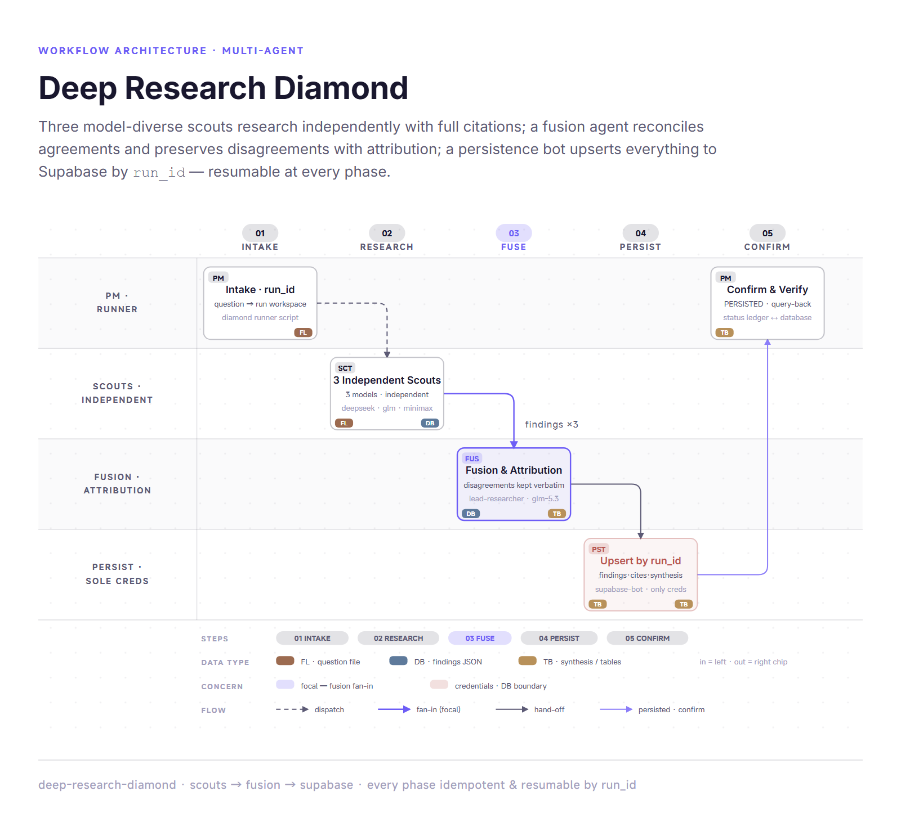

# Deep Research Diamond

Fan-out three model-diverse scout bots → fuse with attribution → persist to Supabase by `run_id`. Every phase is idempotent and resumable.



## When to Use

- A research question benefits from **genuinely independent model passes** (different training biases surface different sources and different errors)
- Findings must be **durable and queryable** later (raw findings + synthesis by `run_id`)
- Disagreements must be **preserved with attribution**, never averaged away
- The run may be interrupted and must **resume** without redoing completed phases

**Do NOT use for** quick lookups or single-model research — use an in-session research fan-out (e.g. delegate_task) for that. This workflow exists specifically because in-process delegation children all inherit the parent's model, so per-scout model diversity requires separate Hermes profiles.

## Agents

| Agent | Model | Status | Role |
|---|---|---|---|
| `scout-deepseek` | deepseek-v4-flash | **new** | Independent research scout #1 |
| `scout-glm` | glm-5.3-flash | **new** | Independent research scout #2 |
| `scout-minimax` | MiniMax-M3 | **new** | Independent research scout #3 |
| `lead-researcher` | glm-5.3 | **reused** | Fusion agent: agreements, disagreements (attributed), synthesis, confidence |
| `supabase-bot` | deepseek-v4-flash | **reused** | Persistence node — fleet's ONLY DB credential holder |
| PM (initiating agent) | any | — | Launches runner, owns resume decisions, receives confirmation |

**Creating the scouts:** `hermes profile create` has no `--model` flag and `hermes model` is interactive-only. The reliable path is to **clone an existing profile whose `config.yaml` already pins the target model** (`model.default` + `model.provider`), so the clone inherits the model config with zero hand-editing. If you don't have such profiles, pin the model in the clone's `config.yaml` afterward with `hermes -p <bot> config set ...`.

## One-Time Setup

```bash
# 1. Create scouts by cloning profiles that already pin each target model
hermes profile create scout-deepseek --clone-from <profile-pinning-deepseek> --description "Deep-research scout (deepseek-v4-flash). Independent parallel research with cited findings JSON." --no-alias
hermes profile create scout-glm      --clone-from <profile-pinning-glm>      --description "Deep-research scout (glm-5.3-flash). Independent parallel research with cited findings JSON." --no-alias
hermes profile create scout-minimax  --clone-from <profile-pinning-minimax>  --description "Deep-research scout (MiniMax-M3). Independent parallel research with cited findings JSON." --no-alias

# 2. Strip MCP servers from the scouts (cloning brings the source's servers along)
for b in scout-deepseek scout-glm scout-minimax; do
  for s in $(hermes -p $b mcp list 2>/dev/null | awk 'NR>2 {print $1}'); do
    hermes -p $b mcp remove "$s"
  done
done

# 3. Write each scout's SOUL.md (templates in references/contracts.md)
#    → <hermes-profiles-dir>/<bot>/SOUL.md

# 4. Audit: only supabase-bot holds DB credentials
for b in scout-deepseek scout-glm scout-minimax; do hermes -p $b mcp list; done   # expect: none

# 5. Apply the DB migration (supabase-bot does this on first run, or send it
#    references/contracts.md §schema directly)
```

## Run Procedure

The runner script (`scripts/run-deep-research.sh`) owns the whole diamond. Launch it via the terminal tool with `background=true, notify_on_complete=true` — the parallel fan-out uses bash `&` + `wait`, which the terminal tool rejects in foreground command strings.

```bash
# New run
./scripts/run-deep-research.sh new "Compare 2026 EV purchase incentives across the US, Canada, and the EU — with citations"

# Resume an interrupted run (re-runs ONLY incomplete phases)
./scripts/run-deep-research.sh resume dr-20260227-101533-ev-incentives
```

Phases, in order:

1. **Intake** — runner mints `run_id` = `dr-YYYYMMDD-HHMMSS-<slug>`, creates `~/deep-research-runs/<run_id>/` with `question.txt` + `status.json` ledger.
2. **Wave 1 (fan-out)** — three scouts invoked in **parallel** via `hermes -p <bot> chat -Q --query-file <prompt>`. One-shot mode = fresh session per scout per run → no shared context, by construction. Each scout writes `findings-<bot>.{json,md}` + `log-<bot>.txt` to the run dir.
3. **Fusion** — `lead-researcher` reads all three findings files raw, writes `fusion.json`. Runner validates structurally (`agreements`, `disagreements`, `synthesis`, `confidence` keys must all exist — a missing `disagreements` key is a hard reject). Fusion bot is contractually forbidden from fetching new data.
4. **Persistence** — runner sends `supabase-bot` one persist request (all findings + fusion + citations). It upserts (idempotent on natural keys) and replies `PERSISTED <row counts>`. Runner marks `persist: complete` only on that confirmation.
5. **Done** — synthesis delivered to the PM/user; `status.json` and the DB agree.

## Resumability Contract

- **Disk is the source of truth for resume.** Every artifact lives in `~/deep-research-runs/<run_id>/`; `status.json` is the phase ledger.
- Resume skips any phase whose artifact exists **and** validates (`findings-*.json` parses; `fusion.json` has all four keys; persist confirmation in log).
- DB writes are **upserts keyed on natural keys** (`run_id`+`agent`; `run_id`+`agent`+`citation_id`; `run_id`) — re-persisting never duplicates.
- A failed scout does not block re-running the others; fusion waits for all three.

## Data Contracts

Full text in `references/contracts.md` (scout findings schema, fusion schema, SOUL templates, prompt templates, Supabase SQL). Summary:

- **findings-\<bot\>.json** — `claims[]` (each with ≥1 `citation_id`), `citations[]` (url, title, publisher, accessed_at), `open_questions[]`. An uncited claim goes to `open_questions`, never to `claims`.
- **fusion.json** — `agreements[]` (≥2 scouts, agents listed), `disagreements[]` (every position verbatim **with attribution** + `what_would_resolve`), `unique_contributions[]`, `synthesis`, `confidence{level, note}`. Citation refs are prefixed `agent:citation_id` for traceability across scouts.
- **research.\* tables** — `runs` (status ledger), `findings` (raw per-scout payload JSONB), `citations` (normalized, traceable), `syntheses` (fusion JSONB). Never drop or overwrite `disagreements` — they are the point of the design.

## Handoffs & Confirmations

| From | To | Payload | Confirmation |
|---|---|---|---|
| PM | runner | question text | `RUN_ID=` echoed; run dir created |
| runner | scout ×3 (parallel) | question + output contract (query file) | `findings-<bot>.json` exists and parses |
| runner | lead-researcher | 3 findings paths + fusion contract | `fusion.json` parses + 4 required keys present |
| runner | supabase-bot | persist request (paths + instruction) | `PERSISTED` + row counts in reply log |
| supabase-bot | PM (via runner) | confirmation | `status.json` ↔ DB status agree |

## Pitfalls

- **Questions containing `$` amounts get eaten by bash** — invoking `run.sh new "... $53,000 ... $350/month ..."` inside double quotes expands `$5`/`$3`/`$4`/`$1` as empty positional params: `$53,000`→`3,000`, `$350`→`50`, `$400`→`00` (observed in a real run). Scouts then research a corrupted premise. Single-quote the question (or write it to a file and have the runner read it) whenever it contains dollar amounts. Unit-cost findings (per-100-km, deltas, %) survive this fine — only user-specific totals are corrupted, and the PM can recompute totals from cited unit figures with the real inputs.
- **Never migrate scouts to in-process delegation** (e.g. delegate_task) for convenience — you lose model diversity and independence (shared parent context). This is the one thing that makes the profile substrate non-optional.
- **Bots need native Windows paths** in prompts (`C:/Users/<you>/deep-research-runs/...`). MSYS `/c/...` paths fail inside bot sessions. On Linux/macOS, plain `$HOME` paths work.
- **Prompt files, not inline `-q "..."`** — quotes truncate long contracts; `--query-file` is the reliable channel.
- **Terminal tool rejects `&` in foreground commands** — the fan-out must live inside the runner script, executed with `background=true`.
- **Scout logs start with query echo + "Initializing agent..."** — parse past them (`tail -40` of the log) when checking for `DONE`/errors.
- **Supabase-bot reply parsing** — require the literal `PERSISTED` keyword before marking the phase complete; anything else (including a chatty "I have stored...") is a retry.
- **Boot test verifies identity, not tool use** — a scout can echo "scout-minimax-OK" and still end its first real turn after one narration sentence with zero tool calls (observed with MiniMax-M3 on a long contract prompt). Two hardenings shipped: (a) scout prompts say "START IMMEDIATELY with your first web_search call — do not reply with a plan first"; (b) `run_wave1` retries each failed scout once (attempt-1 log preserved as `log-<bot>-attempt1.txt`) before declaring the wave incomplete.
- **Persist prompt must inline the migration SQL** — `supabase-bot` cannot resolve references to this skill's contracts file (different profile); the runner's `persist_prompt` embeds the full idempotent `research.*` DDL.
- **Airtable instead of Supabase** — the persist contract is sink-agnostic JSON. Swap the target by repointing the persistence step; keep the same natural keys and confirmation keyword.
- **Fresh clones carry the source profile's memory/skills** — harmless (identity, not run contamination), but strip MCP servers; the credential blast radius must stay at exactly one bot (`supabase-bot`).
- **Scout model pins can end up CROSSED after cloning** — observed scout-glm pinned to minimax and scout-minimax pinned to glm (the reverse of the design), which silently swaps model diversity and corrupts findings' self-reported `model` strings. Audit `profiles/<bot>/config.yaml` (`model.default` + `model.provider` + `model.base_url`) before every run; fix with `hermes -p <bot> config set ...`, never hand-edits.
- **OpenRouter streaming can hang scout-glm entirely** — two attempts produced 0-byte logs (upstream idle timeout before first token). Fix: repin scout-glm to the vendor's direct API (`model.provider=zai`, `model.base_url=https://api.z.ai/api/coding/paas/v4`, `model.default=glm-5.3-flash` — same model; the provider key was already present in the cloned `.env`).
- **Long-synthesis scouts outlive the per-attempt timeout** — a scout researched exhaustively (50 web_search calls in one turn, hitting the per-turn search cap) then died during its long final write; three 30-min attempts all failed the same way. `BOT_TIMEOUT` is env-overridable (`BOT_TIMEOUT=3600 bash run-deep-research.sh resume <id>`). Reliable recovery: launch the scout directly on its own `prompt-<bot>.txt` with a 1-hour `timeout`; if it still dies post-search/pre-write, resume its session: `hermes -p <bot> chat --resume <session_id> -q 'No more web searches — write the two deliverable files now from what you gathered'` — session resume preserves the entire research context. Then `resume` the runner; validated phases skip.
- **Query-back SQL for verification: pass plain single-quoted SQL** — chr()|| escaping chains misparse in Postgres (`->` binds tighter than `||` → `jsonb_array_length(text)` error) and quote characters embedded in a chr chain change the compared value, matching nothing. Write the query to a file and pass `--query-file`, or state the intent and let the bot requote; it verifies read-only either way.

## Verification

Before declaring a run complete:
- `findings-*.json` ×3 parse and every claim has ≥1 citation
- `fusion.json` has all four keys; sample one disagreement and confirm the positions are attributed and verbatim
- `log-persist.txt` contains `PERSISTED`; `research.runs.status = 'complete'` matches `status.json`
- Query back: `select agent, jsonb_array_length(payload->'claims') from research.findings where run_id = '<run_id>'` returns 3 rows
